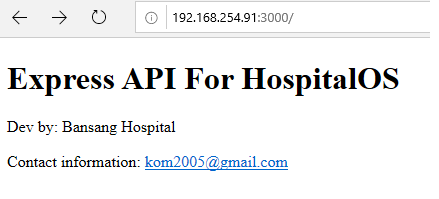
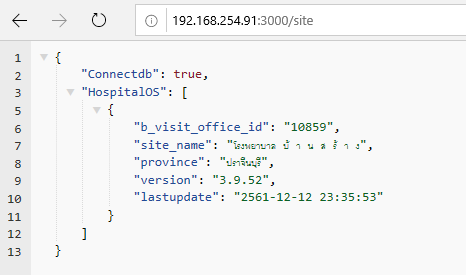

# HospitalOS API ExpressJS and TypeScript

## Installation
Node.js version 8.x or latest
```
npm i typescript -g
npm i ts-node -g
npm i pm2 -g
```

```
git clone https://github.com/k2003/HospitalOS_Express_API.git myApi
cd myApi
npm i

and 

tsc

```
## Setting Connection

update config connection db in `env.txt` for production

```
DB_HOST=127.0.0.1
DB_PORT=5432
DB_NAME=hospotalos
DB_USER=postgres
DB_PASSWORD=xxxxxx
SECRET_KEY=##hospital-api##@
PORT=3000

```

## Running
```
cp env.txt .env
npm start

or 

nodemon

```

## TEST
```
open browser and go to http://localhost:3000
```

```
test connect db postgres
open browser and go to http://localhost:3000/site
```

# PM2
```
pm2 start --interpreter ts-node src/bin/www.ts MyServerName

```

